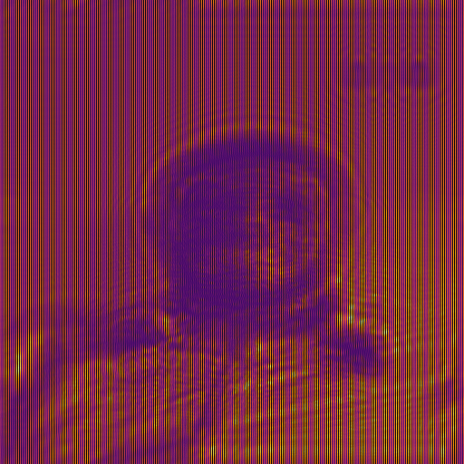
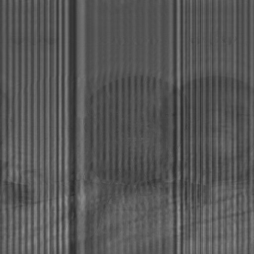

# Introducton
Digital holography is a powerful technique in computational optics that enables the capture and reconstruction of wavefronts from intensity-only measurements. It bridges the gap between physical optics and numerical simulation, allowing researchers to visualize and recover object fields using principles of interference, diffraction, and inverse propagation. This project presents a simulation framework that models the formation and reconstruction of a digital hologram using Fresnel diffraction theory, implemented entirely in Python with NumPy and Matplotlib.
The simulation begins by encoding a grayscale image as a complex object field, optionally augmented with synthetic phase to simulate phase objects. This field is numerically propagated to a virtual sensor plane using a Fresnel transfer function, which models near-field diffraction effects. A reference wave,  either on-axis or off-axis  is introduced to interfere with the propagated object wave, producing a simulated hologram that mimics the intensity pattern captured by a digital camera.
Reconstruction is performed by back propagating the recorded hologram using the conjugate of the original transfer function. This process approximates the inverse wavefront evolution, revealing the original object’s amplitude and phase structure. The simulation supports adjustable parameters such as propagation distance, reference wave tilt, and phase strength, enabling exploration of key holographic concepts including off-axis interference, resolution limits, and phase recovery.
By visualizing the original object, the simulated hologram, and the reconstructed image side-by-side, the framework offers intuitive insight into the physics of holography and the computational tools used to analyze it. The use of animated ray tracing and Fourier-based reconstruction techniques further enhances interpretability, making the project suitable for both instructional use and research prototyping.
This work demonstrates core competencies in wavefront modeling, numerical optics, and scientific visualization — foundational skills for  research in photonics, computational imaging, and optical system design. It provides a hands-on platform for understanding how light interacts with matter, how interference encodes spatial information, and how algorithms can recover hidden structure from intensity data alone.

## 📌 Overview
This project simulates the formation and reconstruction of digital holograms using Fresnel diffraction theory. It models how a complex object field interacts with a reference wave to produce an interference pattern, and how that pattern can be computationally back-propagated to recover the original object. The simulation is built entirely in Python using NumPy, Matplotlib, and PIL, and is designed for educational, research, and visualization purposes in computational optics and wavefront analysis.

## 🧠 Physics Context
- **Wavefront Propagation**: Simulates near-field diffraction using the Fresnel transfer function.
- **Interference & Holography**: Models the interaction between object and reference waves to produce a digital hologram.
- **Inverse Reconstruction**: Recovers the object field by back-propagating the recorded intensity using Fourier techniques.
- **Phase Objects**: Optionally adds synthetic phase to simulate transparent or refractive structures.

## 🚀 Features
- Adjustable parameters: grid size, wavelength, propagation distance, reference wave tilt, phase strength.
- Supports both on-axis and off-axis reference waves.
- Optional phase encoding for phase object simulation.
- Visualizes original object, hologram, and reconstruction side-by-side.
- Saves all outputs automatically for reproducibility.
- Compatible with MP4 export (requires FFmpeg).
  # For ease of usage:
1. Clone the repository
2. 	Open  in Jupyter.
3. 	Set your local image path in the  variable.
4. 	Run all cells to generate hologram and reconstruction.
# 🎯 Research & Educational Value
# Ideal for:
• 	Teaching wave optics and holography fundamentals.
• 	Demonstrating Fresnel propagation and inverse imaging.
• 	Prototyping computational imaging techniques.
# 👤 Author
Developed by Alhassan Kpahambang Fuseini
#  📄 License
MIT License.
